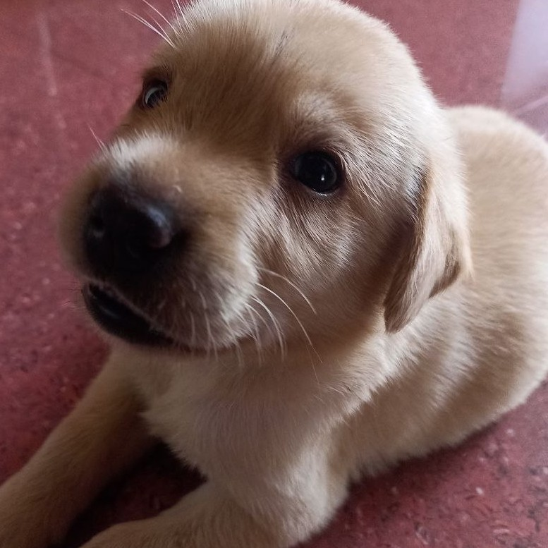

# ScratchFormers
### implementing transformers from scratch.

> Attention is all you need.

## Modules

- **[einops starter](./_modules/einops.ipynb)**
  
- **[attentions](./_modules/attentions.ipynb)**
  - multi-head causal attention
  - multi-head cross attention
  - multi-head grouped query attention (torch + einops)
  
- **positional embeddings**
  - [rotary positional embeddings (RoPE)](./_modules/rope.ipynb)
  
- **[Low-Rank Adaptation (LoRA)](./_modules/LoRA/)**
  - implementing LoRA based on this wonderful [tutorial by Sebastian Raschka](https://lightning.ai/lightning-ai/studios/code-lora-from-scratch?view=public&section=all)
  - finetuning LoRA adapted `deberta-v3-base` on IMDb dataset

- **[KV Cache](./_modules/KV-Cache/)**
  - implemented KV Cache that supports RoPE
  - Works and verified with Llama (RoPE + GQA) 

## Models

- **LlaMA**
  - for process, check [building_llama_complete.ipynb](./LLaMA/building_llama_complete.ipynb)
  - model [implementation](./LLaMA/llama.py)
  - inference (used [SmolLM2-135M-Instruct](https://huggingface.co/HuggingFaceTB/SmolLM2-135M-Instruct) which is based on LlaMA architecture but super small) [code](./LLaMA/llama-inference.ipynb) [kaggle](https://www.kaggle.com/code/shreydan/llama/)
  - super cool resource: [LLMs From Scratch by Sebastian Raschka](https://github.com/rasbt/LLMs-from-scratch)
  - added KV Caching support: [llama_with_kv_caching.ipynb](./_modules/KV-Cache/llama_with_kv_caching.ipynb)

- **simple Vision Transformer**
  - for process, check [building_ViT.ipynb](./ViT/building_ViT.ipynb)
  - model [implementation](./ViT/vit.py)
  - used `mean` pooling instead of `[class]` token


- **GPT2**
  - for process, check [buildingGPT2.ipynb](./GPT2/buildingGPT2.ipynb)
  - model [implementation](./GPT2/gpt2.py)
  - built in such a way that it supports loading pretrained openAI/huggingface weights [gpt2-load-via-hf.ipynb](./GPT2/gpt2-load-via-hf.ipynb)
  - for my own custom trained causal LM, checkout [shakespeareGPT](https://github.com/shreydan/shakespeareGPT) which is although a bit more like GPT-1.


- **OpenAI CLIP**
  - implemented `ViT-B/32` variant
  - for process, check [building_clip.ipynb](./OpenAI-CLIP/building_clip.ipynb)
  - inference req: install clip for tokenization and preprocessing: `pip install git+https://github.com/openai/CLIP.git`
  - model [implementation](./OpenAI-CLIP/model.py)
  - zero-shot inference [code](./OpenAI-CLIP/zeroshot.py)
  - built in such a way that it supports loading pretrained openAI weights and IT WORKS!!!
  - My lighter implementation of this using existing image and language models trained on Flickr8k dataset is available here: [liteCLIP](https://github.com/shreydan/liteclip)


- **Encoder Decoder Transformer**
  - for process, check [building_encoder-decoder.ipynb](./encoder-decoder/building_encoder-decoder.ipynb)
  - model [implementation](./encoder-decoder/model.py)
  - src_mask for encoder is optional but is nice to have since it is used to mask out the pad tokens so attention is not considered for those tokens.
  - used learned embeddings for position instead of sin/cos as per the OG.
  - I trained a model for multilingual machine translation.
    - Translates english to hindi and telugu.
    - change: single encoder & decoder embedding layer since I used a single tokenizer.
    - for the code and results check: [shreydan/multilingual-translation](https://github.com/shreydan/multilingual-translation)


- **BERT - MLM**
  - for process of masked language modeling, check [masked-language-modeling.ipynb](./BERT-MLM/masked-language-modeling.ipynb)
  - model [implementation](./BERT-MLM/model.py)
  - simplification: for pre-training no use of [CLS] & [SEP] tokens since I only built the model for masked language modeling and not for next sentence prediction. 
  - I trained an entire model on the wikipedia dataset, more info in [shreydan/masked-language-modeling](https://github.com/shreydan/masked-language-modeling) repo.
  - once, pretrained the MLM head can be replaced with any other downstream task head.

- **ViT MAE**
  - Paper: [Masked autoencoders are scalable vision learners](https://arxiv.org/abs/2111.06377)  
  - model [implementation](./vitmae/model.py)
  - for process, check: [building-vitmae.ipynb](./vitmae/building-vitmae.ipynb)
  - Quite reliant on the original code released by authors.
  - Only simplification: No [CLS] token so used mean pooling
  - The model can be trained 2 ways:
    - For pretraining: the decoder can be thrown away and the encoder can be used for downstream tasks
    - For visualization: can be used to reconstruct masked images.
  - I trained a smaller model for reconstruction visualization: [ViTMAE on Animals Dataset](./vitmae/animals-vitmae.ipynb)

- **UNETR**
  - 3D segmentation model for medical domain
  - Transformer based architecture, more [info](https://paperswithcode.com/method/unetr)
  - process: [building_unetr](./UNETR/building_unetr.ipynb) 


### Requirements
```
einops
torch
torchvision
numpy
matplotlib
pandas
```

---


Here's my puppy's picture:


---

```
God is our refuge and strength, a very present help in trouble.
Psalm 46:1
```